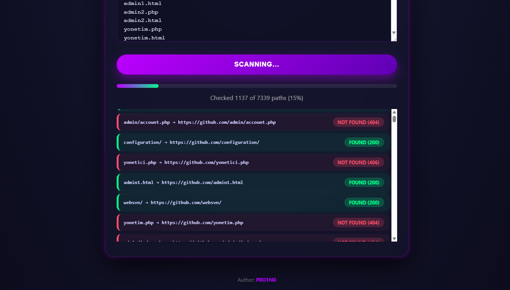

# Admin Panel Finder

## Description
A Python script to find possible admin panel paths on a target website.

## Features
- Fast scanning
- Custom wordlist support
- Status code detection

## Disclaimer
This tool is for educational purposes only.

# Installation
To install and use, just run the APF.py file.

  
  

